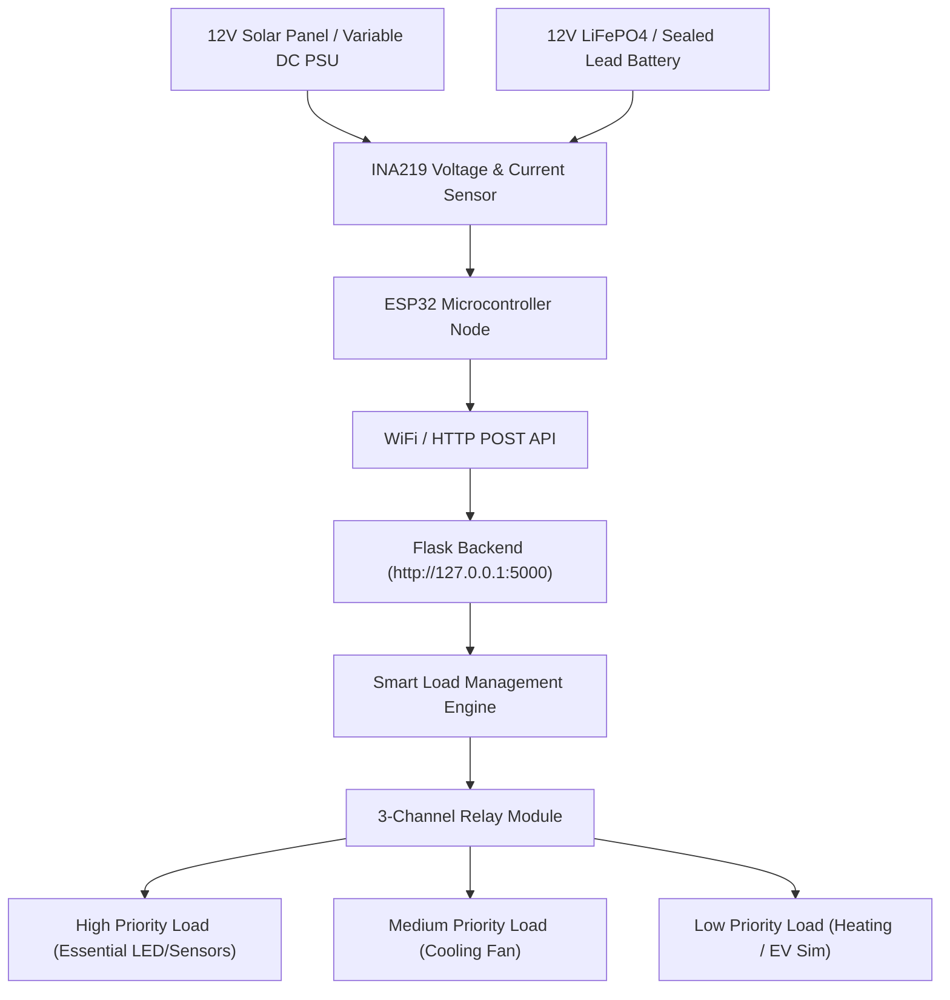

# EcoPower Hardware Prototype Guide (SIH 2026)

This directory contains the hardware circuit specifications, component bill of materials (BOM), pin connection diagrams, and embedded C++ microcontroller code for the **EcoPower - Smart Renewable Energy Generation and Management System**.

## Prototype Philosophy
The EcoPower prototype is designed specifically for **Smart India Hackathon (SIH 2026)** to safely demonstrate automated microgrid energy management using low-voltage, highly accessible, and low-cost IoT components.

> [!IMPORTANT]
> **Safety First:** The physical prototype strictly operates on **safe low-voltage DC (5V to 18V DC)**. It simulates high-voltage industrial or home loads using safe DC relays, LEDs, and small DC fans/resistors. **No high-voltage AC grid power is required or recommended for hackathon demonstrations.**

---

## Directory Structure
- [`components.md`](file:///C:/Users/Ram/.gemini/antigravity/scratch/EcoPower/hardware/components.md) - Detailed component list, specifications, and approximate costs.
- [`wiring.md`](file:///C:/Users/Ram/.gemini/antigravity/scratch/EcoPower/hardware/wiring.md) - Pinout table, circuit connection instructions, and breadboard setup.
- [`controller_code/esp32_ecopower.ino`](file:///C:/Users/Ram/.gemini/antigravity/scratch/EcoPower/hardware/controller_code/esp32_ecopower.ino) - Complete Arduino / ESP32 C++ firmware with WiFi telemetry, serial output, and 3-channel relay control.

---

## Microcontroller Operations & Flow

---

## Quick Setup & Flashing Instructions
1. Install **Arduino IDE** (v2.0 or higher).
2. Add ESP32 Board Manager URL: `https://raw.githubusercontent.com/espressif/arduino-esp32/gh-pages/package_esp32_index.json`
3. Install required libraries via Arduino Library Manager:
   - `Adafruit INA219`
   - `ArduinoJson` (v6.x)
   - `Adafruit SSD1306` (Optional OLED display)
4. Open [`hardware/controller_code/esp32_ecopower.ino`](file:///C:/Users/Ram/.gemini/antigravity/scratch/EcoPower/hardware/controller_code/esp32_ecopower.ino).
5. Update your WiFi Credentials (`WIFI_SSID` and `WIFI_PASSWORD`) and Flask Server IP URL (`http://<YOUR_LAPTOP_IP>:5000/api/energy`).
6. Select Board **ESP32 Dev Module** and press **Upload**.
